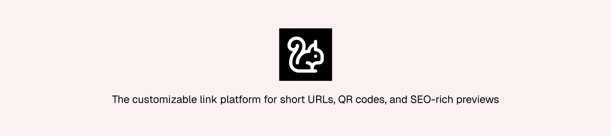

  <picture>
    <source srcset="./public/banner-dark.png" media="(prefers-color-scheme: dark)">
    <source srcset="./public/banner.png" media="(prefers-color-scheme: light)">
    
  </picture>
  <h2 align="center">
    Docut
  </h2>

## About the Project

Docut is a customizable link platform that helps you build stronger digital connections. Create short URLs, generate QR codes — all with SEO-friendly titles and descriptions for richer previews on social platforms. Integrate easily using the backend SDK and manage everything from a clean dashboard.

### Why Docut

Sharing links is more than shortening a URL. Docut lets you control how links appear when shared (title, description, and preview), track engagement, create QR codes, and integrate the flow into your own services with the SDK.

## Contribution

Docut is an open-source project under the MIT License.

You can help continue its development by:

- Opening pull requests on the repository: https://github.com/KaikSelhorst/docut
- Suggesting new features and reporting issues: https://github.com/KaikSelhorst/docut/issues

## Security
If you discover a security vulnerability within Docut, please email oficial.kaikselhorst@gmail.com.

All reports will be promptly addressed, and you'll be credited accordingly.